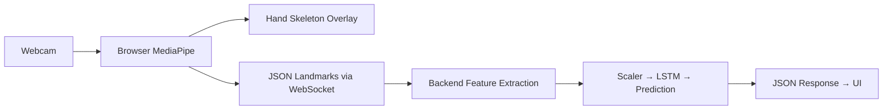

# ISL Translator — Move MediaPipe to Frontend

Move hand detection from the Render backend to the browser. The webcam feed will be processed locally by MediaPipe in the browser, and only JSON landmark coordinates will be sent to the backend over WebSocket. This eliminates JPEG frame transfer, reduces latency, and offloads GPU/CPU work from the server.

## New Data Flow



## Proposed Changes

### Frontend

---

#### [MODIFY] [mediapipe.js](file:///d:/Web_Projects/isl-translator/frontend/src/mediapipe.js)

- Change WASM path from jsDelivr CDN to local: `FilesetResolver.forVisionTasks("/mediapipe/wasm")`
- No other changes needed — model path and config already correct.

---

#### [MODIFY] [App.jsx](file:///d:/Web_Projects/isl-translator/frontend/src/App.jsx)

This is the major frontend change. The current App.jsx is a minimal skeleton with camera + MediaPipe drawing only (no WebSocket, no prediction UI). It will be rewritten to include:

**Camera Start/Stop control:**
- Add a Start Camera / Stop Camera button instead of auto-starting.
- On start: request webcam, create ONE WebSocket connection, begin MediaPipe processing loop.
- On stop: cancel animation frame, stop camera tracks, close WebSocket, reset all state.

**WebSocket management:**
- Exactly ONE WebSocket per camera session.
- Use a ref (`wsRef`) to hold the connection. Check `readyState === WebSocket.OPEN` before every send.
- Backend URL from `import.meta.env.VITE_BACKEND_URL || "ws://127.0.0.1:10000"`, with `/ws/predict` appended.
- On receiving messages from backend: update prediction text, confidence, frame counter, status.

**MediaPipe processing loop:**
- Use `requestAnimationFrame` loop.
- Use a monotonically increasing timestamp counter (start from `performance.now()` at init, then only advance forward using `Math.max(lastTs + 1, performance.now())`).
- For each frame: detect hands, draw skeleton on canvas, then send landmarks as JSON to WebSocket.
- When no hands detected: send `{ "type": "no_hand" }` to backend.

**Landmark JSON format sent to backend:**
```json
{
  "type": "landmarks",
  "timestamp": 123456,
  "hands": [
    [ {"x": 0.1, "y": 0.2, "z": 0.01}, ... ]
  ]
}
```

**UI (preserving existing design system from App.css):**
- Reuse existing CSS classes: `.app`, `.header`, `.main`, `.camera-card`, `.result-card`, `.video-container`, `.video`, `.controls`, `.status`, `.frame-info`, `.prediction`, `.confidence`, `.info`.
- Add: hands detected count, frame counter (`0/20` → `20/20`), prediction text, confidence display, status indicators.
- Prevent excessive console logging — use throttled debug logging.

**Reset behavior:**
- When backend sends `status: "ready"` with `frames: 0`: clear prediction, confidence, reset frame counter to `0/20`.

---

#### [MODIFY] [App.css](file:///d:/Web_Projects/isl-translator/frontend/src/App.css)

- Add `.canvas` class for the skeleton overlay canvas (absolute positioned over video).
- Minor additions for status indicators and frame counter styling. No redesign.

---

### Backend

---

#### [MODIFY] [server.py](file:///d:/Web_Projects/isl-translator/backend/server.py)

**Remove:**
- `import cv2`
- `import mediapipe as mp`
- All MediaPipe initialization (options, landmarker creation, MEDIAPIPE_MODEL path)
- JPEG decoding (`cv2.imdecode`, `np.frombuffer`)
- RGB conversion (`cv2.cvtColor`)
- `mp.Image` construction
- `landmarker.detect_for_video()` call
- `landmarker.close()` in finally block
- `timestamp_ms` and `FRAME_INTERVAL_MS` (no longer needed)

**Change:**
- `receive_bytes()` → `receive_text()` then `json.loads()`
- Parse incoming JSON: extract `type`, `hands` array
- Handle `type: "no_hand"` — increment `no_hand_count`, trigger reset after 5 consecutive
- Handle `type: "landmarks"` — convert hands array to features using updated `landmarks_to_features()`

**Keep unchanged:**
- All prediction logic (sliding window, stabilization, confidence thresholds)
- All config constants (SEQUENCE_LENGTH, CONFIDENCE_THRESHOLD, etc.)
- FastAPI app, CORS, safe_send
- Model loading, scaler, labels, device

---

#### [MODIFY] [features.py](file:///d:/Web_Projects/isl-translator/backend/features.py)

**Change `process_single_hand()`:**
- Accept a list of 21 dicts `[{"x": ..., "y": ..., "z": ...}, ...]` instead of MediaPipe landmark objects.
- Access `.get("x")` / dict keys instead of `.x` attribute.
- Math remains identical: `landmark["x"] - wrist["x"]`, etc.

**Change `landmarks_to_features()`:**
- Accept a raw `hands` list (from JSON) instead of a MediaPipe `result` object.
- `hands[0]` → first hand, `hands[1]` → second hand (if present).
- Padding logic unchanged (63 zeros for missing hand).

---

#### [MODIFY] [requirements.txt](file:///d:/Web_Projects/isl-translator/backend/requirements.txt)

- Remove `mediapipe>=0.10.0`
- Remove `opencv-python-headless`
- These are no longer needed on the server.

---

#### [MODIFY] [Dockerfile](file:///d:/Web_Projects/isl-translator/Dockerfile)

- Remove system dependencies for OpenCV/MediaPipe: `libgl1`, `libegl1`, `libgles2`, `libglib2.0-0`, `libsm6`, `libxrender1`, `libxext6`.
- This significantly reduces Docker image size.

---

## What Does NOT Change

| Component | Status |
|---|---|
| [model.py](file:///d:/Web_Projects/isl-translator/backend/model.py) | **Unchanged** — SignBiLSTM architecture stays identical |
| `best_model.pt` | **Unchanged** — no retraining |
| `scaler.pkl` | **Unchanged** — same scaler |
| `labels.json` | **Unchanged** — same 9 classes |
| Feature representation | **Unchanged** — 126 features, wrist-relative, no normalization |
| Sequence length | **Unchanged** — 20 frames |
| Confidence thresholds | **Unchanged** — 0.60 / 0.65 |
| Stabilization logic | **Unchanged** — 3 stable predictions required |
| Release detection | **Unchanged** — 5 frames with no hand |
| [index.css](file:///d:/Web_Projects/isl-translator/frontend/src/index.css) | **Unchanged** — design system preserved |
| [main.jsx](file:///d:/Web_Projects/isl-translator/frontend/src/main.jsx) | **Unchanged** |
| `package.json` | **Unchanged** — `@mediapipe/tasks-vision` already listed |
| Public WASM/model files | **Unchanged** — already in `public/mediapipe/wasm/` and `public/models/` |

## Verification Plan

### Manual Verification

1. Run backend locally: `cd backend && uvicorn server:app --host 0.0.0.0 --port 10000`
2. Run frontend locally: `cd frontend && npm run dev`
3. Test flow:
   - Click "Start Camera" → webcam starts, WebSocket connects
   - Show hands → skeleton overlay visible, frame counter increments `0/20` → `20/20`
   - Hold sign → prediction appears with confidence
   - Remove hands → counter resets to `0/20`, prediction clears
   - Click "Stop Camera" → everything stops cleanly
   - Click "Start Camera" again → single new WebSocket, no duplicates
4. Check browser console: no excessive logging, no WebSocket errors
5. Frontend build: `npm run build` should succeed for Vercel deployment

### Deployment

- **Vercel**: Redeploy frontend. Set `VITE_BACKEND_URL=wss://isl-translator-v2.onrender.com` environment variable.
- **Render**: Redeploy Docker container. Smaller image (no OpenCV/MediaPipe). Faster cold starts.
